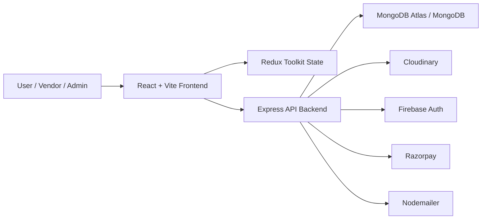

# Rent-A-Ride


Rent-A-Ride is a full-stack car rental platform built with separate User, Vendor, and Admin experiences. It combines vehicle browsing, booking, vendor fleet management, and admin operations into one connected system.

## Live Demo

- Frontend: [rent-a-ride-two.vercel.app](https://rent-a-ride-two.vercel.app)
- Backend health: [rent-a-ride-zq00.onrender.com/health](https://rent-a-ride-zq00.onrender.com/health)

## Feature Highlights

- Multi-role platform with User, Vendor, and Admin flows
- Dedicated admin panel with live summary, bookings control, and vendor approval queue
- Vehicle search, filter, sort, and location-based browsing
- Vendor vehicle add, edit, delete, and booking updates
- Booking lifecycle connected across all roles
- Firebase Google login support
- Razorpay payment flow integration
- Cloudinary image upload support
- Production-ready deployment setup for Vercel + Render

## Why This Project Stands Out

- It goes beyond a basic CRUD app by supporting three connected product roles.
- It covers real full-stack concerns like auth, uploads, payments, dashboards, and deployment.
- The user, vendor, and admin modules all operate on the same booking and vehicle data flow.
- It includes both operational tools and customer-facing UX, which makes it a stronger portfolio project.
- The codebase is already structured for online deployment with env templates, health checks, and split hosting.

## Modules

### User
- Sign up and sign in with email/password
- Google login through Firebase
- Browse vehicles
- Search by district and location
- Filter and sort vehicles
- View vehicle details
- Book rides and complete checkout
- View personal orders
- Edit profile details

### Vendor
- Separate vendor sign up and sign in
- Add vehicles
- Edit and delete vendor vehicles
- View vendor bookings
- Update booking status
- Monitor vehicles and booking activity from vendor dashboard

### Admin
- Separate admin sign in page
- View live dashboard summary
- View all users
- View all vendors
- View all vehicles
- Add and manage vehicles
- Review vendor vehicle requests
- View and update booking statuses

## Role-Based Feature Table

| Capability | User | Vendor | Admin |
| --- | --- | --- | --- |
| Sign up / Sign in | Yes | Yes | Yes |
| Google login | Yes | No | No |
| Browse vehicles | Yes | Limited dashboard view | Full fleet view |
| Book vehicle | Yes | No | No |
| View own orders | Yes | No | No |
| Manage booking status | No | Yes | Yes |
| Add vehicle | No | Yes | Yes |
| Edit/Delete vehicles | No | Own vehicles | Admin fleet |
| View all platform vehicles | No | Own listings | Yes |
| Review vendor requests | No | No | Yes |
| View all users/vendors | No | No | Yes |
| Access admin dashboard | No | No | Yes |

## Tech Stack

### Frontend
- React 18
- Vite
- Redux Toolkit
- Redux Persist
- React Router DOM
- Tailwind CSS
- Material UI
- React Hook Form
- Zod
- React Hot Toast
- React Icons
- Firebase Auth

### Backend
- Node.js
- Express
- MongoDB with Mongoose
- JWT authentication
- Multer
- Cloudinary
- Nodemailer
- Razorpay

## Folder Structure

```text
Rent-a-Ride/
├── backend/
│   ├── controllers/
│   ├── models/
│   ├── routes/
│   ├── utils/
│   └── server.js
├── client/
│   ├── public/
│   ├── src/
│   │   ├── components/
│   │   ├── pages/
│   │   ├── redux/
│   │   └── utils/
│   └── vite.config.js
├── DEPLOYMENT.md
├── render.yaml
└── package.json
```

## Architecture Diagram



More editable diagrams:

- [docs/PROJECT_DIAGRAMS.md](./docs/PROJECT_DIAGRAMS.md)

## Installation

### 1. Clone the repository

```bash
git clone https://github.com/kushagra751/Rent-A-Ride.git
cd Rent-a-Ride
```

### 2. Install backend dependencies

```bash
npm install
```

### 3. Install frontend dependencies

```bash
cd client
npm install
cd ..
```

### 4. Configure environment variables

Use these templates:

```bash
.env.example
client/.env.example
```

### 5. Start backend

```bash
npm run dev
```

Backend runs on:

```text
http://localhost:3001
```

### 6. Start frontend

Open a new terminal:

```bash
cd client
npm run dev
```

Frontend usually runs on:

```text
http://localhost:5173
```

## Environment Variables

Backend example keys:

```env
NODE_ENV=
PORT=
mongo_uri=
ACCESS_TOKEN=
REFRESH_TOKEN=
FRONTEND_URL=
FRONTEND_APP_URL=
CLOUD_NAME=
API_KEY=
API_SECRET=
EMAIL_HOST=
EMAIL_PASSWORD=
RAZORPAY_KEY_ID=
RAZORPAY_SECRET=
COOKIE_DOMAIN=
```

Frontend example keys:

```env
VITE_PRODUCTION_BACKEND_URL=
VITE_RAZORPAY_KEY_ID=
VITE_FIREBASE_API_KEY=
VITE_FIREBASE_AUTH_DOMAIN=
VITE_FIREBASE_PROJECT_ID=
VITE_FIREBASE_STORAGE_BUCKET=
VITE_FIREBASE_MESSAGING_SENDER_ID=
VITE_FIREBASE_APP_ID=
```

Full deployment notes:

- [DEPLOYMENT.md](./DEPLOYMENT.md)

## Default Demo Logins

### Admin
- Email: `admin@demo.com`
- Password: `admin123`

### Vendor
- Email: `vendor@demo.com`
- Password: `vendor123`

Note: for final production use, replace demo accounts and rotate secrets.

## Important Routes

### Public
- `/`
- `/vehicles`
- `/enterprise`
- `/contact`
- `/signin`
- `/signup`
- `/vendorSignin`
- `/vendorSignup`
- `/adminSignin`

### User protected
- `/profile`
- `/profile/orders`
- `/vehicleDetails`
- `/availableVehicles`
- `/checkoutPage`
- `/razorpay`

### Vendor protected
- `/vendorDashboard`

### Admin protected
- `/adminDashboard`
- `/adminDashboard/allProduct`
- `/adminDashboard/allUsers`
- `/adminDashboard/allVendors`
- `/adminDashboard/vendorVehicleRequests`
- `/adminDashboard/orders`

## API Areas

### Auth
- `/api/auth/signup`
- `/api/auth/signin`
- `/api/auth/google`
- `/api/auth/refreshToken`

### User
- `/api/user/...`

### Vendor
- `/api/vendor/...`

### Admin
- `/api/admin/login`
- `/api/admin/showVehicles`
- `/api/admin/showUsers`
- `/api/admin/showVendors`
- `/api/admin/summary`
- `/api/admin/allBookings`
- `/api/admin/fetchVendorVehilceRequests`

## Deployment

Recommended setup:

- Frontend: Vercel
- Backend: Render
- Database: MongoDB Atlas

## Screenshots

### User Side


### Admin Side


### Vendor Side


## Build and Checks

### Frontend build

```bash
cd client
npm run build
```

### Frontend lint

```bash
cd client
npm run lint
```

### Backend start

```bash
npm start
```

## Health Check

Backend health endpoint:

```text
/health
```

Example:

```text
http://localhost:3001/health
```

It reports whether MongoDB is connected.

## Current Project Status

- User side working
- Vendor side working
- Admin side working
- Separate admin login page
- Deployed-data fixes across user, vendor, and admin flows
- Improved admin UI for dashboard and add vehicle flow

## Notes

- Some legacy admin template dependencies and styles are still present in the client.
- Production build may still show warnings about older CSS references and large bundle size, but the app builds successfully.
- If localhost shows a blank page, restart the frontend after the latest changes so Vite picks up the updated files.

## Author

Kushagra
