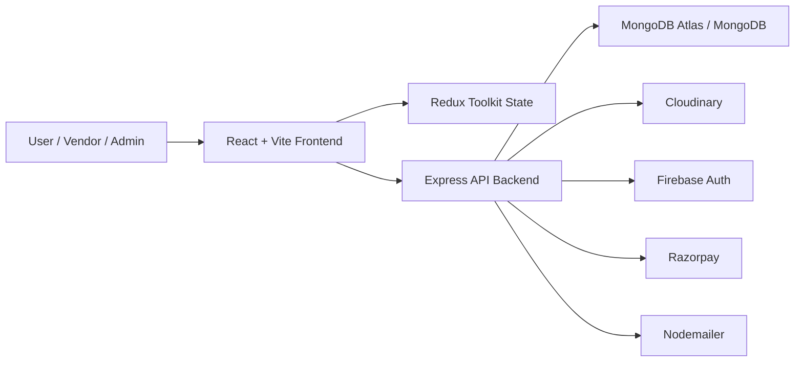

# Rent-A-Ride


Rent-A-Ride is a full-stack car rental platform with three main roles:

- User
- Vendor
- Admin

The project includes a Vite + React frontend, an Express + MongoDB backend, role-based authentication, vehicle management, booking flows, vendor approvals, and an admin operations panel.

## Feature Highlights

- Multi-role platform with separate User, Vendor, and Admin flows
- Dedicated admin panel with live dashboard, booking control, and vendor approval queue
- Vehicle discovery with search, filter, sort, and location-based browsing
- Vendor vehicle management with add, edit, delete, and booking updates
- Booking lifecycle management across user, vendor, and admin panels
- Firebase Google login support
- Razorpay payment integration flow
- Cloudinary image upload support
- Production-ready split deployment setup for frontend and backend

## Modules

### User
- Sign up and sign in with email/password
- Google login support through Firebase
- Browse vehicles
- Search by district and location
- Filter and sort vehicle listings
- View vehicle details
- Book rides and complete checkout flow
- View and manage personal orders
- Edit profile details

### Vendor
- Separate vendor sign up and sign in
- Add vehicles
- Edit and delete vendor vehicles
- View bookings
- Manage booking status
- Monitor available vehicles and requests from vendor dashboard

### Admin
- Separate admin sign in page
- View live dashboard summary
- View all users
- View all vendors
- View all vehicles
- Add and manage vehicles
- Review vendor vehicle requests
- View and update booking statuses

## Tech Stack

### Frontend
- React 18
- Vite
- Redux Toolkit
- Redux Persist
- React Router DOM
- Tailwind CSS
- Material UI
- React Hook Form
- Zod
- React Hot Toast
- React Icons
- Firebase Auth

### Backend
- Node.js
- Express
- MongoDB with Mongoose
- JWT authentication
- Multer
- Cloudinary
- Nodemailer
- Razorpay

## Folder Structure

```text
Rent-a-Ride/
├── backend/
│   ├── controllers/
│   ├── models/
│   ├── routes/
│   ├── utils/
│   └── server.js
├── client/
│   ├── public/
│   ├── src/
│   │   ├── components/
│   │   ├── pages/
│   │   ├── redux/
│   │   └── utils/
│   └── vite.config.js
├── DEPLOYMENT.md
├── render.yaml
└── package.json
```

## Architecture Diagram



## Key Features

- Role-based access for user, vendor, and admin
- JWT access token and refresh token support
- Dedicated admin sign-in flow
- Protected routes for all secure areas
- Vendor approval workflow
- Admin dashboard with live production data
- Booking status management
- Cloudinary image upload integration
- Razorpay payment flow support
- Firebase Google authentication support
- Production-ready deployment setup for Render + Vercel

## Local Development

## Prerequisites

- Node.js
- npm
- MongoDB local instance or MongoDB Atlas
- Cloudinary account for image upload
- Firebase project for Google login
- Razorpay account for payment integration

## Install Dependencies

### Backend

From the project root:

```bash
npm install
```

### Frontend

```bash
cd client
npm install
```

## Run Locally

### Start backend

From project root:

```bash
npm run dev
```

Backend runs on:

```text
http://localhost:3001
```

### Start frontend

In a separate terminal:

```bash
cd client
npm run dev
```

Frontend usually runs on:

```text
http://localhost:5173
```

## Environment Variables

Use:

- [.env.example](./.env.example)
- [client/.env.example](./client/.env.example)

### Backend variables

Typical backend variables:

```env
NODE_ENV=
PORT=
mongo_uri=
ACCESS_TOKEN=
REFRESH_TOKEN=
FRONTEND_URL=
FRONTEND_APP_URL=
CLOUD_NAME=
API_KEY=
API_SECRET=
EMAIL_HOST=
EMAIL_PASSWORD=
RAZORPAY_KEY_ID=
RAZORPAY_SECRET=
COOKIE_DOMAIN=
```

### Frontend variables

Typical frontend variables:

```env
VITE_PRODUCTION_BACKEND_URL=
VITE_RAZORPAY_KEY_ID=
VITE_FIREBASE_API_KEY=
VITE_FIREBASE_AUTH_DOMAIN=
VITE_FIREBASE_PROJECT_ID=
VITE_FIREBASE_STORAGE_BUCKET=
VITE_FIREBASE_MESSAGING_SENDER_ID=
VITE_FIREBASE_APP_ID=
```

## Default Demo Logins

These are available through the current local/deployed bootstrap flow if seeded:

### Admin
- Email: `admin@demo.com`
- Password: `admin123`

### Vendor
- Email: `vendor@demo.com`
- Password: `vendor123`

Note: in production, you should replace demo accounts and rotate all secrets before final use.

## Important Routes

### Public
- `/`
- `/vehicles`
- `/enterprise`
- `/contact`
- `/signin`
- `/signup`
- `/vendorSignin`
- `/vendorSignup`
- `/adminSignin`

### User protected
- `/profile`
- `/profile/orders`
- `/vehicleDetails`
- `/availableVehicles`
- `/checkoutPage`
- `/razorpay`

### Vendor protected
- `/vendorDashboard`

### Admin protected
- `/adminDashboard`
- `/adminDashboard/allProduct`
- `/adminDashboard/allUsers`
- `/adminDashboard/allVendors`
- `/adminDashboard/vendorVehicleRequests`
- `/adminDashboard/orders`

## API Areas

### Auth
- `/api/auth/signup`
- `/api/auth/signin`
- `/api/auth/google`
- `/api/auth/refreshToken`

### User
- `/api/user/...`

### Vendor
- `/api/vendor/...`

### Admin
- `/api/admin/login`
- `/api/admin/showVehicles`
- `/api/admin/showUsers`
- `/api/admin/showVendors`
- `/api/admin/summary`
- `/api/admin/allBookings`
- `/api/admin/fetchVendorVehilceRequests`

## Deployment

Deployment guide:

- [DEPLOYMENT.md](./DEPLOYMENT.md)

Recommended deployment split:

- Frontend: Vercel
- Backend: Render
- Database: MongoDB Atlas

## Screenshots

Add your best project screenshots here to make the repository look stronger for portfolio and review purposes.

Suggested sections:

- User home page
- Vehicle listing and filters
- Vehicle details page
- Checkout / payment page
- User orders page
- Vendor dashboard
- Vendor vehicles page
- Admin dashboard
- Admin bookings page
- Admin vendor request page

Example markdown:

```md


```

If you store screenshots in another folder, update the paths accordingly.

## Build and Checks

### Frontend build

```bash
cd client
npm run build
```

### Frontend lint

```bash
cd client
npm run lint
```

### Backend start

```bash
npm start
```

## Health Check

Backend health endpoint:

```text
/health
```

Example:

```text
http://localhost:3001/health
```

It reports whether MongoDB is connected.

## Current Project Status

This repository currently includes:

- user side working
- vendor side working
- admin side working
- separate admin login page
- deployed-data fixes for admin/vendor/user flows
- improved admin UI for dashboard and add vehicle flow

## Notes

- Some legacy admin template dependencies and styles are still present in the client.
- Production build may still show warnings about older CSS references and large bundle size, but the app builds successfully.
- If localhost shows a blank page, restart the frontend after the latest changes so Vite picks up the updated files.

## Author

Kushagra
