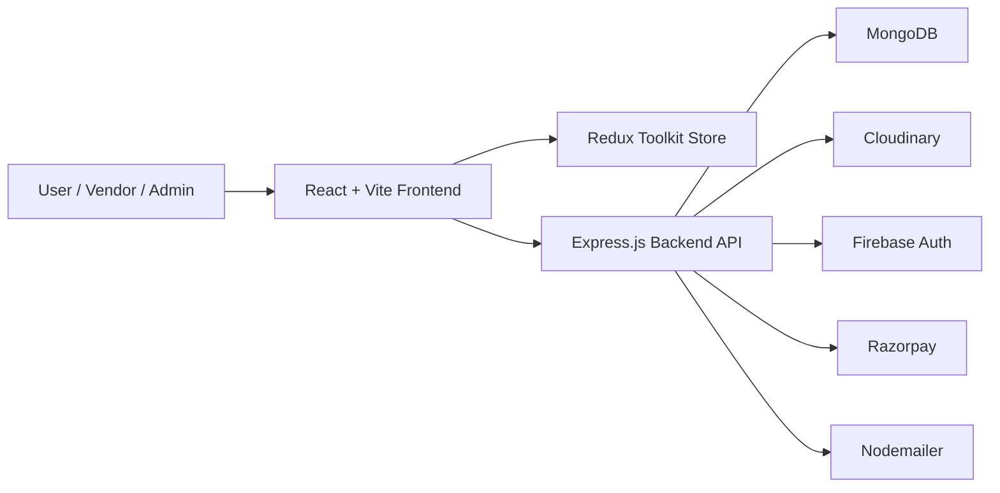
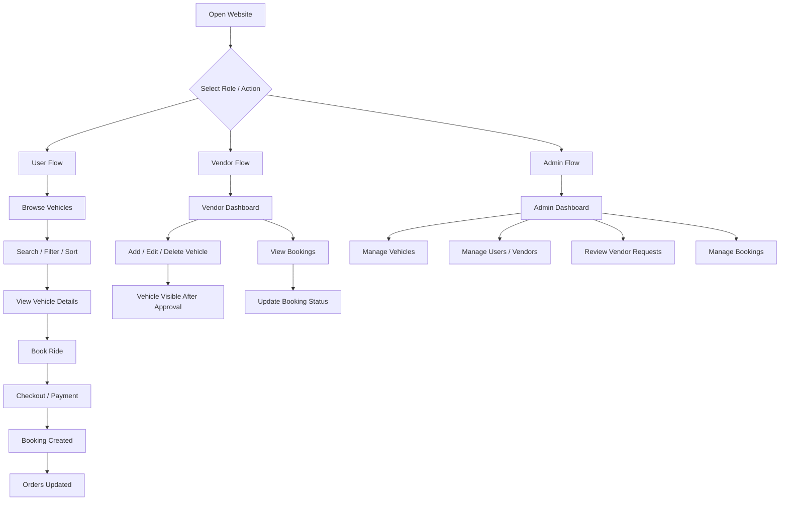
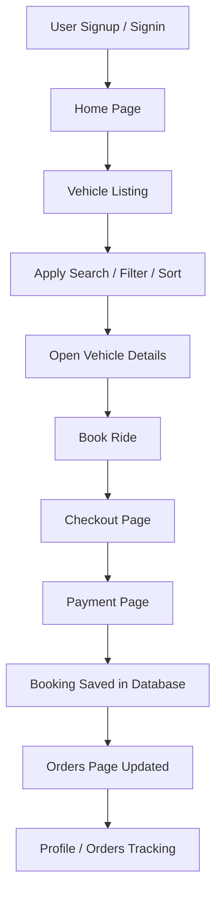
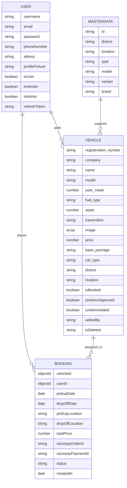
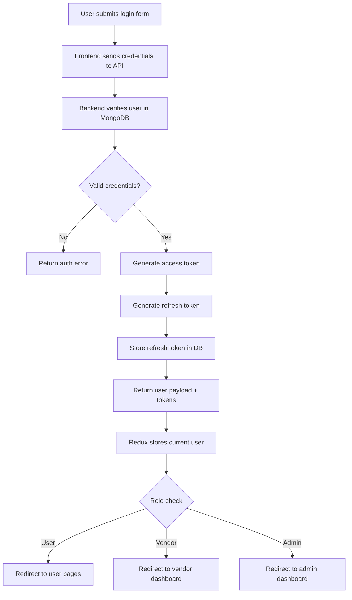
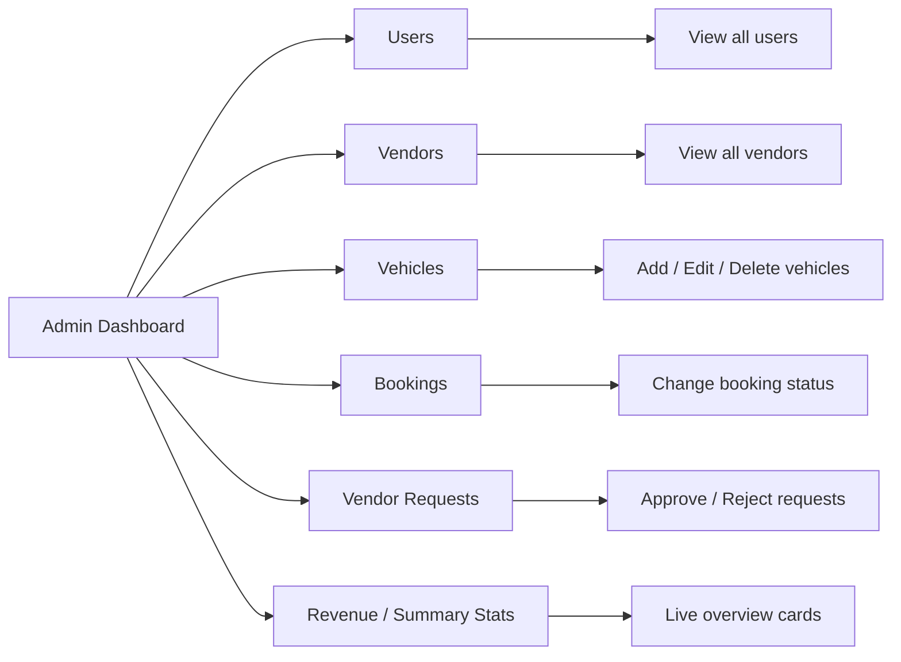
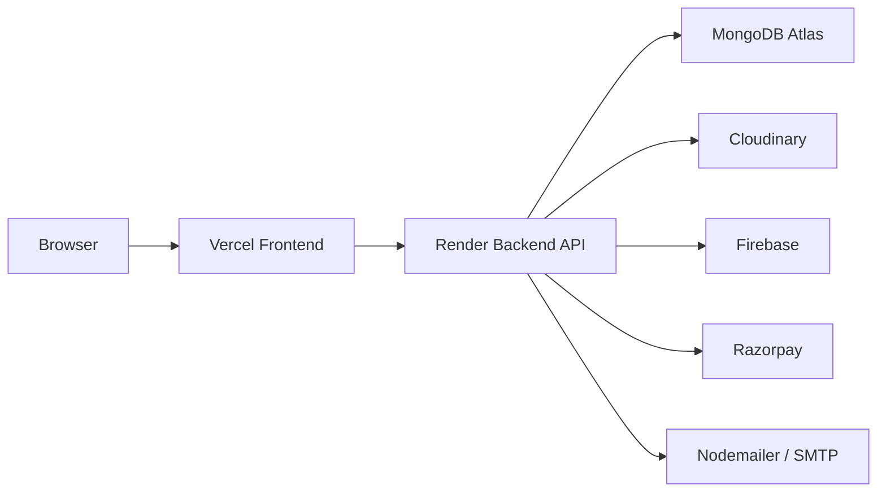

# Project Diagrams

This file contains editable Mermaid diagrams for the Rent-A-Ride platform.

You can use these directly in:

- GitHub Markdown
- Documentation pages
- Presentation exports
- Mermaid Live Editor

## 1. System Architecture Diagram

## 2. Overall System Flowchart

## 3. User Module Workflow

## 4. Database ER Diagram

## 5. Login and Authentication Flow

## 6. CRM Dashboard Overview

## 7. Deployment Architecture (Vercel + Render)

## Usage Notes

- These diagrams are editable and version-friendly.
- If you need presentation-ready exported PNGs, paste them into [Mermaid Live Editor](https://mermaid.live/) and export as image.
- If you want, these same diagrams can also be embedded into the main [README.md](../README.md).
